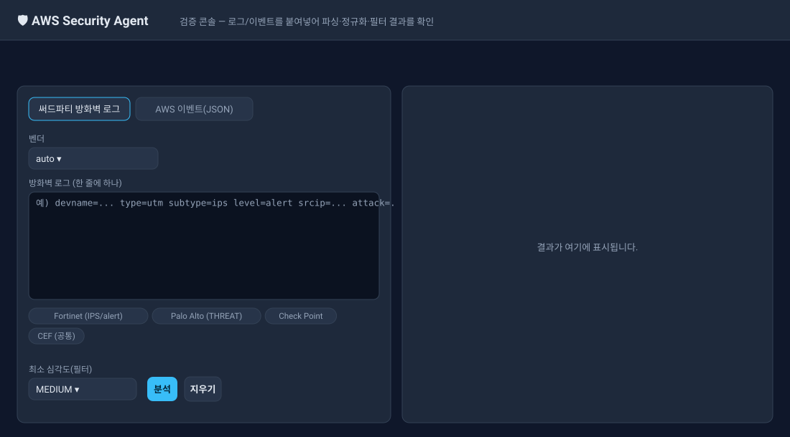
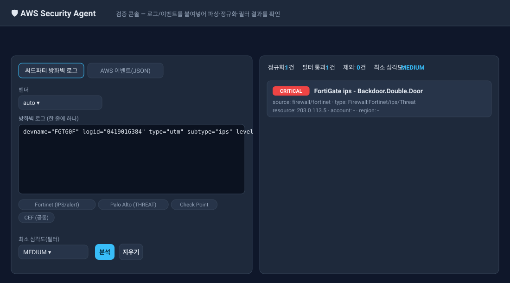
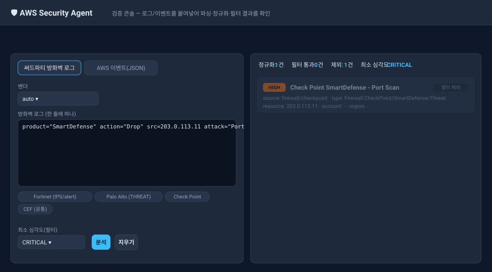
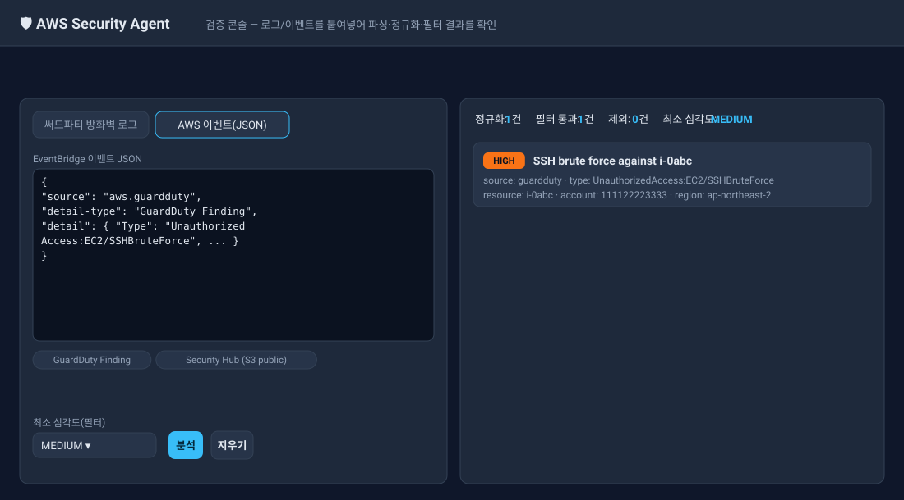
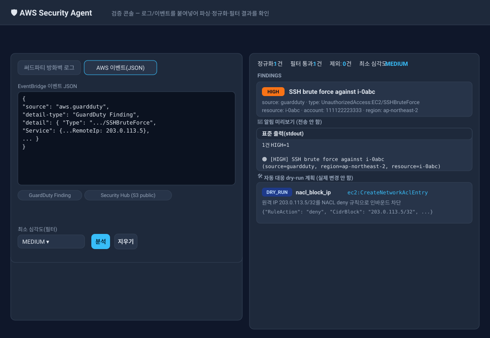

# 따라하기 매뉴얼 — AWS Security Monitoring Agent

이 문서는 **아무것도 모르는 상태에서 시작해** 이 시스템을 내려받고, 실행하고, 검증하고, (원하면) AWS에 배포하는 전 과정을 순서대로 따라 할 수 있도록 만든 가이드입니다.

- 예상 소요: 로컬 검증까지 **약 10분** (AWS 계정 불필요)
- 이 매뉴얼의 **1~4단계는 AWS 자격증명이 전혀 필요 없습니다.** 파싱·정규화·필터 로직을 로컬에서 그대로 검증할 수 있습니다.
- 저장소: https://github.com/leeyonsei78/kiro-aws-security-agent

---

## 이 시스템이 하는 일 (30초 요약)

AWS 보안 신호(GuardDuty, Security Hub, Security Group, IAM Access Analyzer, CloudTrail, VPC Flow Logs)와 **써드파티 방화벽 로그**(Palo Alto / Fortinet / Check Point / CEF)를 받아서:

```
수집 → 통합 스키마로 정규화 → 심각도 필터 → 알림(Slack/Email) → (선택) 자동 대응
```

- **collector 7종 · notifier 3종 · remediator 6종 · 방화벽 파서 4종**
- 자동 대응(remediator)은 **기본 비활성 + dry-run 기본**이라 안전합니다.

---

## 0단계 · 사전 준비물

| 필요한 것 | 확인 방법 | 비고 |
|-----------|-----------|------|
| Python 3.10 이상 | `python --version` | 3.11 권장 |
| git | `git --version` | 코드 clone용 |
| (배포 시) AWS 계정 + SAM 또는 Terraform | — | 1~4단계엔 불필요 |

> **중요:** 이 저장소의 실행 코드에는 **외부 파이썬 패키지 의존성이 없습니다.** 로컬 검증(1~4단계)에서는 `pip install`이 필요 없습니다. (AWS에 실제로 붙는 것은 Lambda 런타임에 내장된 boto3를 사용)

---

## 1단계 · 코드 내려받기

본인 PC(로컬) 터미널에서:

```bash
git clone https://github.com/leeyonsei78/kiro-aws-security-agent.git
cd kiro-aws-security-agent
```

지금 위치(`kiro-aws-security-agent/`)가 앞으로 계속 명령을 실행할 **"저장소 루트"**입니다. `ls`를 쳤을 때 `src`, `docs`, `deploy`, `tests`가 보이면 맞습니다.

```bash
ls
# deploy  docs  iam  README.md  requirements.txt  src  tests  ...
```

---

## 2단계 · 자동 테스트로 전체 동작 검증

가장 먼저 "시스템 전체가 정상인가?"를 자동 테스트로 확인합니다. AWS 없이 동작합니다.

> 테스트는 AWS 호출을 흉내 내는 stub(`tests/_stubs`)을 사용하므로 `PYTHONPATH`에 이 경로를 넣습니다.

**Mac / Linux:**
```bash
for t in tests/test_*.py; do PYTHONPATH="tests/_stubs" python "$t" && echo "----"; done
```

**Windows (PowerShell):**
```powershell
Get-ChildItem tests/test_*.py | ForEach-Object {
  $env:PYTHONPATH="tests/_stubs"; python $_.FullName; echo "----"
}
```

### ✅ 기대 결과
각 파일 끝에 `ALL ... TESTS PASSED`가 출력되어야 합니다. 7개 스위트가 모두 통과합니다:

```
ALL TESTS PASSED                 (test_pipeline)
ALL REMEDIATION TESTS PASSED     (test_remediation)
ALL EXTENSION TESTS PASSED       (test_extensions)
ALL EXTENSION2 TESTS PASSED      (test_extensions2)
ALL EXTENSION3 TESTS PASSED      (test_extensions3)
ALL FIREWALL TESTS PASSED        (test_firewall)
ALL WEBUI TESTS PASSED           (test_webui)
```

하나라도 `Traceback`이나 `AssertionError`가 나오면 Python 버전(3.10+)을 먼저 확인하세요.

---

## 3단계 · 웹 검증 콘솔로 눈으로 확인 (핵심)

브라우저에서 로그/이벤트를 붙여넣어 파싱·정규화·필터 결과를 직접 보는 단계입니다. **AWS 자격증명 불필요.**

### 3-1. 서버 실행

저장소 루트에서:

**Mac / Linux:**
```bash
PYTHONPATH=src python -m agent.webui.server
```

**Windows (PowerShell):**
```powershell
$env:PYTHONPATH="src"; python -m agent.webui.server
```

아래처럼 출력되면 성공입니다:
```
웹 검증 UI: http://127.0.0.1:8080  (Ctrl+C로 종료)
```

### 3-2. 브라우저 접속

같은 PC의 브라우저에서 **http://127.0.0.1:8080** 접속하면 아래와 같은 초기 화면이 뜹니다:



화면 구성:
- **왼쪽**: 입력 패널 — 상단 2개 탭(방화벽 로그 / AWS 이벤트), 벤더 선택, 입력창, 샘플 칩, 최소 심각도 필터, [분석]·[지우기] 버튼
- **오른쪽**: 결과 패널 — 분석 전에는 "결과가 여기에 표시됩니다."

### 3-3. 화면에서 검증하기

1. 상단 탭에서 **"써드파티 방화벽 로그"** 선택
2. 입력창 위의 **샘플 칩** 중 `Fortinet (IPS/alert)` 클릭 → 예시 로그가 자동 입력됨
3. **최소 심각도(필터)** 를 `MEDIUM`으로 둠
4. **[분석]** 버튼 클릭

**✅ 기대 결과 (우측):**
- 요약: `정규화 1건 · 필터 통과 1건 · 제외 0건 · 최소 심각도 MEDIUM`
- 빨간 `CRITICAL` 배지 + "FortiGate ips - Backdoor..." finding 1건
- source: `firewall/fortinet`



### 3-4. 필터가 실제로 동작하는지 확인

1. **최소 심각도**를 `CRITICAL`로 바꾸고
2. 샘플 칩에서 `Check Point`(심각도 High) 클릭 → **[분석]**

**✅ 기대 결과:** `정규화 1건 · 필터 통과 0건 · 제외 1건`, finding이 **흐리게(dim) + "필터 제외"** 뱃지로 표시됨. → 심각도 필터가 정확히 작동한다는 증거입니다.



### 3-5. AWS 이벤트도 확인

1. 상단 탭에서 **"AWS 이벤트(JSON)"** 선택
2. 샘플 칩 `GuardDuty Finding` 클릭 → **[분석]**

**✅ 기대 결과:** `HIGH` 배지의 "SSH brute force" finding 1건, source `guardduty`.



### 3-6. 전체 파이프라인 모드 (알림 + 자동 대응까지 미리보기)

지금까지는 "파싱·필터"까지만 봤습니다. **전체 파이프라인 모드**로 바꾸면 그 뒤 단계인 **알림 메시지**와 **자동 대응(remediation) 계획**까지 한 번에 확인할 수 있습니다. (실제 알림 전송·AWS 변경은 하지 않습니다 — 미리보기/dry-run만)

1. 모드 토글을 **"전체 파이프라인"** 으로 변경
2. **"AWS 이벤트(JSON)"** 탭에서 샘플 칩 `GuardDuty SSH BruteForce (→NACL 차단)` 클릭
3. **[분석]** 클릭

**✅ 기대 결과 (우측):**
- **Findings**: HIGH "SSH brute force" 1건
- **📣 알림 미리보기**: 활성 채널(예: stdout/Slack/Email)로 보낼 메시지 텍스트
- **🛠️ 자동 대응 dry-run 계획**: `nacl_block_ip` → `ec2:CreateNetworkAclEntry`로 공격 IP `203.0.113.5/32`를 NACL에서 차단하는 계획



> 다른 샘플도 시도해 보세요:
> - `GuardDuty IAM 자격증명` → `iam_disable_key` (액세스 키 비활성화 계획)
> - `Security Hub S3 public` → `s3_public_block` (Public Access Block 계획)
> - `GuardDuty EC2 백도어` → `ec2_quarantine` (격리 SG 교체 계획)
>
> 대응 계획이 안 나오는 경우: 해당 finding_type이 대응 대상이 아니거나, 대상 리소스 정보(원격 IP/서브넷 등)가 샘플에 없어서입니다. WAF/EC2 격리 등 일부 대응은 대상 설정(IPSet ID·격리 SG ID)이 있어야 계획이 생성됩니다.

> 서버 종료: 터미널에서 `Ctrl + C`

> 📌 위 화면 이미지들은 실제 콘솔의 색상·레이아웃을 그대로 재현한 예시입니다. 표시되는 finding 값(심각도·source·resource 등)은 이 시스템이 실제로 출력하는 값과 동일합니다. 본인 PC에서 실행하면 같은 결과를 보게 됩니다.

---

## 4단계 · CLI로 검증 (터미널만으로)

브라우저 없이 명령줄로도 확인할 수 있습니다.

### 4-1. 저장된 이벤트 파일 분석

샘플 이벤트 파일을 하나 만듭니다:

```bash
cat > gd_sample.json <<'JSON'
{"source":"aws.guardduty","detail-type":"GuardDuty Finding","detail":{"Id":"gd-1","Type":"UnauthorizedAccess:EC2/SSHBruteForce","Title":"SSH brute force","Severity":8.0,"Region":"ap-northeast-2","Resource":{"ResourceType":"Instance","InstanceDetails":{"InstanceId":"i-0abc"}}}}
JSON
```

실행 (로컬 검증이므로 stub 경로 포함, 알림은 화면 출력):

```bash
PYTHONPATH="src:tests/_stubs" NOTIFIERS=stdout python -m agent.cli --event gd_sample.json --min-severity MEDIUM
```

**✅ 기대 결과:**
```
[security-agent] 1건 HIGH=1
  🟠 [HIGH] SSH brute force (source=guardduty, account=-, region=ap-northeast-2, resource=i-0abc)
{"matched": 1, "notifiers": ["stdout"], "remediations": []}
```

> `PYTHONPATH="src:tests/_stubs"`는 로컬 검증 전용입니다. 실제 AWS에서 폴링할 때는 `tests/_stubs` 없이 `PYTHONPATH=src`만 쓰고, 자격증명을 표준 방식(환경변수/프로파일)으로 설정합니다.

---

## 5단계 · (선택) AWS에 배포

실제 AWS 계정에 올려 운영하려면 아래 중 하나를 사용합니다. **AWS 자격증명과 권한이 필요합니다.**

### 방법 A — SAM

```bash
cd deploy/sam
sam build
sam deploy --guided \
  --parameter-overrides \
    MinSeverity=HIGH \
    NotificationEmail=본인이메일@example.com \
    SlackWebhookUrl=https://hooks.slack.com/services/XXX/YYY/ZZZ
```

### 방법 B — Terraform

```bash
cd deploy/terraform
terraform init
terraform apply \
  -var 'region=ap-northeast-2' \
  -var 'min_severity=HIGH' \
  -var 'notification_email=본인이메일@example.com'
```

### 배포 후 검증

```bash
# 폴링 경로 (빈 payload로 수동 호출)
aws lambda invoke --function-name security-agent-agent --payload '{}' out.json && cat out.json
```

자세한 옵션(방화벽 webhook 활성화, 자동 대응 켜기 등)은 **[docs/DEPLOY.md](docs/DEPLOY.md)** 참고.

> ⚠️ **자동 대응(remediation) 안전장치:** 실제로 리소스를 변경하려면 `RemediationEnabled=true` **그리고** `RemediationDryRun=false` **그리고** 대응 권한 부여(`EnableRemediationPolicy=true`) — 3가지를 모두 명시해야 합니다. 기본값으로는 절대 실제 변경이 일어나지 않습니다.

---

## 문제 해결 (Troubleshooting)

| 증상 | 원인 / 해결 |
|------|-------------|
| `No module named agent` | `PYTHONPATH`에 `src`가 없음. 저장소 루트에서 `PYTHONPATH=src ...` 로 실행 |
| 테스트에서 `No module named boto3` | 테스트/CLI 로컬 검증 시 `PYTHONPATH`에 `tests/_stubs`를 포함해야 함 |
| 웹 콘솔 접속이 안 됨 | 서버가 떠 있는지, 포트(기본 8080) 충돌 없는지 확인. `--port 9000`으로 변경 가능 |
| `python: command not found` | `python3`로 시도하거나 Python 설치 확인 |
| Windows에서 `PYTHONPATH=...` 안 먹힘 | PowerShell은 `$env:PYTHONPATH="src"; python ...` 문법 사용 |

---

## 어디서 무엇을 찾나 (문서 지도)

| 찾는 내용 | 파일 |
|-----------|------|
| 전체 개요 | `README.md` |
| **이 따라하기 매뉴얼** | `따라하기_매뉴얼.md` |
| 웹 콘솔 상세 | `docs/WEBUI.md` |
| 배포 상세 (SAM/Terraform/수동) | `docs/DEPLOY.md` |
| 환경변수 설정 | `docs/CONFIG.md` |
| 새 소스/대응 추가 방법 | `docs/EXTENDING.md` |

---

## 체크리스트 (검증 완료 확인용)

- [ ] 1단계: `git clone` 후 저장소 루트에서 `src`가 보인다
- [ ] 2단계: 7개 테스트 스위트 모두 `... PASSED`
- [ ] 3단계: 웹 콘솔에서 Fortinet 샘플 → CRITICAL finding 1건 확인
- [ ] 3-4: 최소 심각도 CRITICAL + Check Point(High) → "필터 제외" 확인
- [ ] 3-5: GuardDuty 샘플 → HIGH finding 확인
- [ ] 3-6: 전체 파이프라인 모드 → 알림 미리보기 + `nacl_block_ip` 대응 계획 확인
- [ ] 4단계: CLI `--event`로 `matched: 1` 확인
- [ ] (선택) 5단계: SAM/Terraform 배포 후 `aws lambda invoke` 성공

여기까지 모두 통과하면 시스템이 정상 동작하는 것입니다. 🎉
